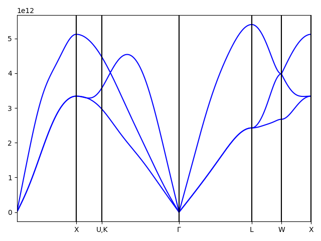
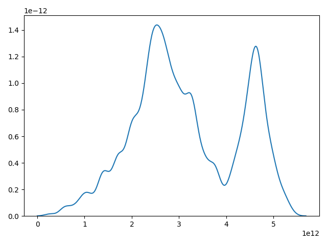
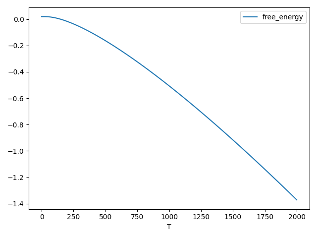

# Overview
Python tools for ATAT phonon 


## original code 
https://github.com/jkitchin/python-atat


# LICENSE

MIT License, Copyright (c) 2024, Hiori Kino


# Purpose

ATAT scripts are written for VASP and csh script and it is difficult to run them on non-VASP. For example, there is not enough explanation to convert str.out. This script was created to help calculate Phonon in ATAT.

# Procedures

1. add {installed_directory}/bin to PATH.

1. Prepare the first structure file.

1. Optimize the structure. The optmized structure is assumed to be opt.vasp. Any periodic structure format can be used if it is read as ASE.Atoms.

1. Execute the following script, which generates kpath. 

```
from atat.kpath import Kpath
import os

filepath = os.path.join(PARENT_DIR, "opt.vasp")
print("load",filepath)
atoms = ase.io.read(filepath,format="vasp")
atoms
kpath = Kpath(atoms)
filepath = os.path.join(PARENT_DIR,"kpath")
kpath.save_kpath(filename=filepath)
kpath.dump(PARENT_DIR)
```

1. Execute bin/step1.sh, which generates vol_0/p* directories, where str.out and POSCAR files exist.

1. Calculate forces for vol0/p*.

1. Execute bin/step2.sh

1. Execute the step3 in this script, which generates figures.

```
from atat import phononPlotter
plotter = phononPlotter(PARENT_DIR)
plotter.plot_dispersion()
plotter.plot_freeenergy()
plotter.plot_dos()
```

## Images
### band dispersion

### DOS

### free energy



# Python Packages necessary

seekpath, spglib, ase

# BUG?

Pt_fcc works well, but PtRh3 BCC doesn't work well.

